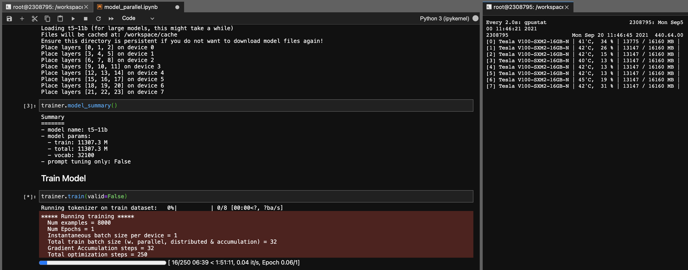

# t2t-tuner

Convenient Text-to-Text Training for Transformers

```shell
pip install t2t-tuner
```

Requires PyTorch: either follow [PyTorch installation instructions](https://pytorch.org/get-started/locally/) or [use a PyTorch container](https://ngc.nvidia.com/catalog/containers/nvidia:pytorch).

## Features

* Easy training for text-to-text (and text generation) tasks
* Training methods/features:
  * Supervised fine-tuning
  * Gradient checkpointing
  * Model parallelism
  * Soft prompt tuning ([based on this paper](https://arxiv.org/abs/2104.08691))
  * Freeze encoder/decoder/embeddings
  * Print model summary
  * [DeepSpeed](https://github.com/microsoft/DeepSpeed)


Based on the wonderful [HuggingFace Transformers](https://github.com/huggingface/transformers) library. Tested on T5 and GPT type of models. In theory, it should work with other models that support [AutoModelForSeq2SeqLM](https://huggingface.co/transformers/model_doc/auto.html#automodelforseq2seqlm) or [AutoModelForCausalLM](https://huggingface.co/transformers/model_doc/auto.html#automodelforcausallm) as well.

The Trainer in this library here is a higher level interface to work based on HuggingFace's [run_translation.py](https://github.com/huggingface/transformers/tree/master/examples/pytorch/translation) script for text-to-text generation tasks. I decided I want a more more convenient interface for training and inferencing, along with access to things like gradient checkpointing and model parallel to fit larger models - these are already in the HuggingFace library but not exposed in the script. I also added in some features that I wanted (prompt tuning, model summary), integrated it with autoregressive LM training and wrapped it as a single library that can be pip installed. 

## Examples

### Training Models

```python
import t2t

trainer_arguments = t2t.TrainerArguments(model_name_or_path="t5-small",
                                         train_file=YOUR_DATASET)

trainer = t2t.Trainer(arguments=trainer_arguments)

# train without validation
trainer.train(valid=False)
```

For more concrete examples, check out the notebooks linked below:

* [Simple example](examples/tldr.ipynb)
* [Simple example on Colab](https://colab.research.google.com/drive/1_BsldxfPl6lVh2dB9VLOvARRxfswfIzL?usp=sharing)
* [Soft Prompt Tuning](examples/soft_prompt_tuning.ipynb)
* [Gradient checkpointing](examples/gradient_checkpointing.ipynb)
* [Model parallelism](examples/model_parallel.ipynb)

### Data Format

**Seq2Seq Training**

```json
{"translation": {"s": "TEXT", "t": "LABEL"}}
```

* The format of data is json-lines, following HuggingFace original script. Each example is one line.
* Define the source and target IDs in `TrainingArguments.source_id` and `TrainingArguments.target_id` (defaults to `s` and `t`).
* Include the prefix in the data file, or define the prefix to prepend to the text in `TrainingArguments.prefix`.
* [Example notebook for data preprocessing from CSV file](sample_data/make_seq2seq_dataset.ipynb)

**Autoregressive LM Training**

* Any text file will work

## Training Large Models

This section will outline how to train large language models (> 1 bil parameters) on relatively simple setups.

Some notes for the configurations reported below:

* GradCheckpoint: Gradient checkpointing to reduce VRAM usage, but increase computation (set `TrainerArguments.gradient_checkpointing`).
* FreezeEmbeds: Freeze (do not train) embedding layer to reduce VRAM usage and computation (set `trainer.freeze(embeddings=True)`).
* Adafactor uses less VRAM than Adam, but is slightly slower and can converge slightly differently.
* You can use gradient accumulation (`TrainingArguments.gradient_accumulation_steps`) to make up to a larger batch size if needed. The batch sizes reported are **without** gradient accumulation.

### GPT Models

Some GPT configurations that were tested to able to train on a single RTX 3090 (24GB) card (without DeepSpeed):

| Model | Params | Precision | Optimizer | InputLen | BatchSize | Other |
| ----- | ------ | --------- | --------- | --------- | --------- | ----- |
| [gpt2](https://huggingface.co/gpt2-xl) | 1.5b | FP16 | Adafactor | 128 | 4 | None |
| [gpt2](https://huggingface.co/gpt2-xl) | 1.5b | FP16 | Adafactor | 496 | 1 | None |
| [gpt2](https://huggingface.co/gpt2-xl) | 1.5b | FP16 | Adafactor | 1024 | 4 | GradCheckpoint |
| [gpt-neo](https://huggingface.co/EleutherAI/gpt-neo-1.3B) | 1.3b | FP16 | Adafactor | 1024 | 1 | None |
| [gpt-neo](https://huggingface.co/EleutherAI/gpt-neo-1.3B) | 1.3b | FP16 | Adafactor | 2048 | 4 | GradCheckpoint |
| [gpt-neo](https://huggingface.co/EleutherAI/gpt-neo-2.7B) | 2.7b | FP16 | Adafactor | 2048 | 4 | GradCheckpoint,FreezeEmbeds |

### T5 Models

Some T5 configurations that were tested to able to train on a single RTX 3090 (24GB) card (without DeepSpeed):

| Model | Params | Precision | Optimizer | Seq2SeqLen | BatchSize | Other |
| ----- | ------ | --------- | --------- | --------- | --------- | ----- |
| [t5](https://huggingface.co/t5-3b) | 3b | FP32 | Adafactor | 128->128 | 1 | FreezeEmbeds |
| [t5](https://huggingface.co/t5-3b) | 3b | FP32 | Adafactor | 128->128 | 1 | GradCheckpoint |
| [t5](https://huggingface.co/t5-3b) | 3b | FP32 | Adafactor | 128->128 | 128 | GradCheckpoint,FreezeEmbeds |
| [t5](https://huggingface.co/t5-3b) | 3b | FP32 | Adafactor | 512->512 | 32 | GradCheckpoint,FreezeEmbeds |

Using this library, you also can fine-tune the [t5-11b checkpoints](https://huggingface.co/models?search=11b) quite easily (single node) with the following settings (without Deepspeed):

* Suggested checkpoint: [t5-11b](https://huggingface.co/t5-11b)
* Batch size 1 + gradient accumulation to make up to whatever batch size you need.
* Batch size of 8 is possible with gradient checkpointing, but doesn't improve the speed.
* Model parallel across multiple GPUs:
  * At least ~90 GB of VRAM
  * Examples: 8x 16GB or 4x 32GB GPU (V100), or 2x 48GB (RTX8000/A6000)
* FP32 (no need for mixed precision/FP16)
  * FP16 would actually be better, but the pretrained T5 checkpoints don't play well with FP16.
  * On Ampere cards (RTX30XX, A100, A6000), TF32 is used, which is faster than FP32 and doesn't suffer from the same issues as FP16.
  * Likely reason: the existing activations are too large ([github issue tracking](https://github.com/huggingface/transformers/pull/10956#issuecomment-813162960), [some more info](https://discuss.huggingface.co/t/mixed-precision-for-bfloat16-pretrained-models/5315))



Note that depending on your system, the loading time for the checkpoint (46GB) can be very long. You'll need ample CPU RAM (at least ~90GB) to load it successfully. 

## ONNX RT

ONNX RT works with some models (not T5, yet) and can provide a small boost in speed.

Install ORT, then set `TrainingArguments.torch_ort=True`

```shell
pip install torch-ort -f https://onnxruntimepackages.z14.web.core.windows.net/onnxruntime_stable_torch190.cu111.html

python -m torch_ort.configure
```

## Development

**Building Package**

```shell
python3 -m pip install --upgrade build twine
python3 -m build
python3 -m twine upload dist/*
```

## Disclaimers

This library as developed as a personal project for my own use. Please feel free to fork or use it for your own purposes as well. I will not take responsibility for any mishaps that occur as a result of this library's usage. 

Note for 3090 FE cards, if your fans hit 100%, it means your VRAM temps are high (>100 deg C). Training for long hours at these temperatures in theory should be fine, but if you want a peace of mind (like me), you can lower the power limit incur minor impact on training speeds. As long as your fans never hit 100%, your VRAM temperatures should be good. For example, to lower power limit to 300W (from 350W):

```shell
sudo nvidia-smi -pl 300
```
